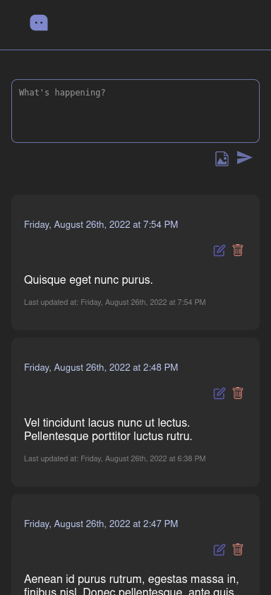

# Full Stack Coding test

### A microblog app

# Neste teste eu utilizei:

 - React.js
 - Nodejs
 - Express.js
 - Axios
 - MongoDB
 - Mongoose
 - react-icons
 - react-modal
 - date-fns

 ## Preview



 ### Instruções

Para executar o back end:

 ```bash
 npm start
 ```

 Para exeutar o front end:

 ```bash
 npm run dev
 ```

Para executar os testes:

```bash
npm test
```